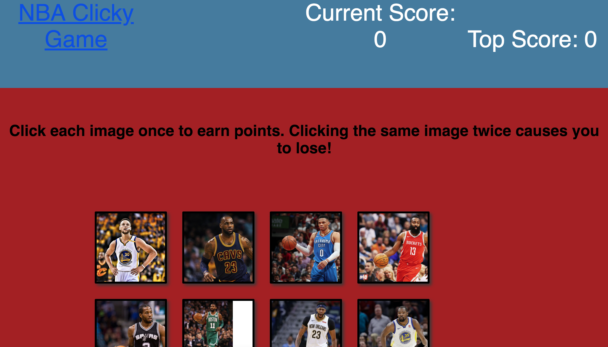

# NBAClickGame
A memory app built with react where users choose an image of a player and accumulates points. If you click the same image twice the game ends.

## Technologies used
- React
- Bootstrap
- CSS
- ES6
- JavaScript

# Screenshot

# Link to App

https://git.heroku.com/nbaclickapp.git
